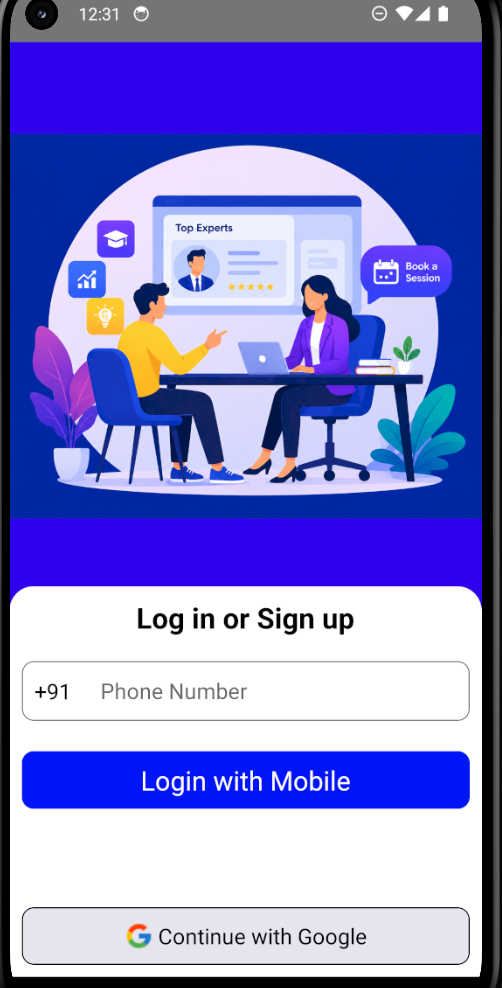
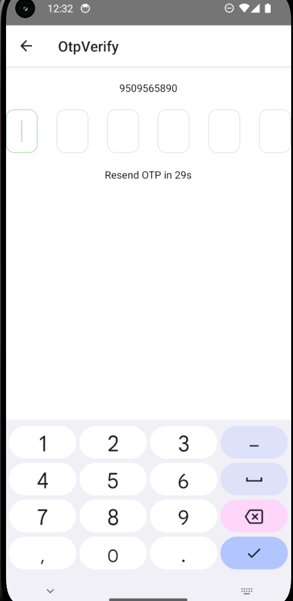

# 📱 Expert Booking App

A modern **Expert Booking** mobile application built with **React Native**. The app enables users to browse experts from different domains, explore expert profiles, and view consultation details through a clean and responsive user interface.

---

## ✨ Features

- 🔐 OTP Authentication (UI)
- 🏠 Modern Home Screen
- 🔍 Search Bar UI
- 📂 Expert Categories
- 👨‍🏫 Top Experts Section
- ⭐ Highest Rated Expert
- 📄 Expert Details Screen
- 💰 Consultation Fee Display
- 📊 Expert Ratings & Reviews
- 👥 Clients & Experience Information
- 📱 Bottom Tab Navigation
- ⚡ React Query Integration
- 🎨 Responsive UI Design

---

## 🛠️ Tech Stack

- React Native
- JavaScript (ES6+)
- React Navigation
- React Query
- React Native OTP Entry

---

## 📂 Project Structure

```
src/
├── api/
├── assets/
│   ├── img/
│   └── screenshots/
├── components/
├── screens/
└── store/
```

---

## 📸 Screenshots

| Onboarding | Login | OTP |
|------------|-------|-----|
|  |  |  |

| Home | Experts | Expert Details |
|------|---------|----------------|
|  |  |  |

---

## 🚀 Getting Started

### Clone the Repository

```bash
git clone https://github.com/YOUR_USERNAME/ExpertBookingApp.git
```

### Navigate to Project

```bash
cd ExpertBookingApp
```

### Install Dependencies

```bash
npm install
```

### Run Android

```bash
npx react-native run-android
```

---

## 🚀 Future Improvements

- 📅 Book Appointment Screen
- 👤 Complete Profile Screen
- 🔐 Google Sign-In Authentication
- 📲 Real OTP Verification using Firebase
- ⚙️ Settings Screen
- 🔎 Search Experts Functionality

---

## 👨‍💻 Author

**Mukesh Rana**

- NIT Trichy
- React Native Developer
- Passionate about Mobile App Development & Problem Solving

---

## ⭐ Support

If you like this project, consider giving it a **⭐ Star** on GitHub.